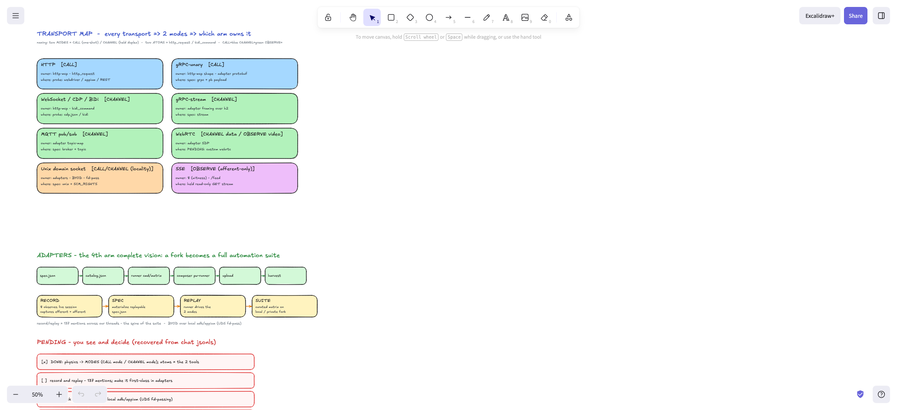
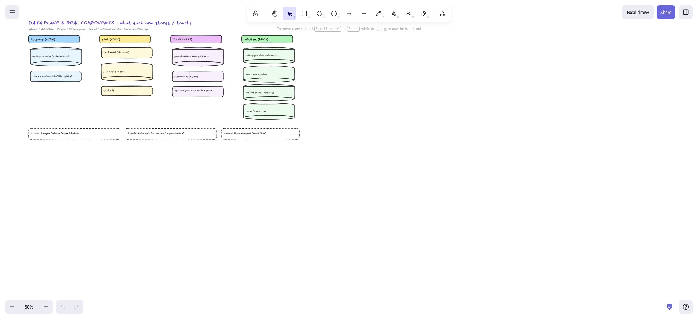
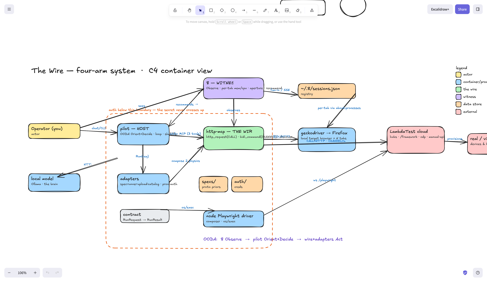
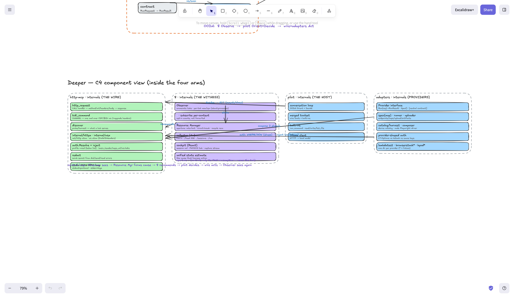

# http-mcp — the WIRE

> Part of **The Wire** — a four-arm system for protocol-agnostic test automation with record & replay.
> **This repo is the http-mcp — the WIRE** — the two modes (CALL/CHANNEL) + auth-injection + probe/harvest. Zero provider awareness.

---

<!-- ===== SHARED TERRITORY (identical across http-mcp · 8 · pilot · adapters) ===== -->

# The Wire — a four-arm system

**Every test/automation interaction reduces to two _modes_ over a deliberately lean wire.**
Capability is composed _above_ the wire by three more arms. A fork of these four arms
turns any existing regression suite into a record-and-replay automation suite.

> The thesis: a wire that holds exactly **two modes** + a generic credential-injection
> mechanism + generic probe/harvest is *enough* to reach every provider, every framework,
> every protocol — without the wire knowing about any of them. Proven live: a 15-combo
> matrix (selenium · appium rd+vd app+web · puppeteer · playwright · espresso · xcui) ran
> through just those two tools.

## The four arms

| Arm | Repo | Gives you | Owns | Never owns |
|---|---|---|---|---|
| **WIRE** | `http-mcp` | reach | the two modes (`http_request`, `bidi_command`), auth-injection mechanism, probe/harvest, route-priors | provider logic, composition, observation |
| **HOST** | `pilot` | agency | local-model OODA Orient+Decide, shell/fs, imports an adapter | the wire's transport, provider shape |
| **WITNESS** | `8` | sight | OODA Observe across all tabs, aperture-control, names the cause, recommends | control of any target — it observes, never drives |
| **ADAPTERS** | `adapters` | shape | per-provider spec/runner/upload/catalog/composer, record→replay, provider-shaped auth | the generic arms (it depends on them, one-way) |

The dependency arrow is one-way: adapters → host/witness → wire. Lower layers never know the upper ones.

## Two MODES, two atoms

A **mode** is an interaction shape — *not* a transport. There are exactly two:

- **CALL** — one request → one response (discrete). Tool: **`http_request`**.
- **CHANNEL** — a held duplex connection you produce commands into and consume events from (continuous). Tool: **`bidi_command`**.

Two modes, two atoms. Everything else is a *dialect* (of a mode) or a *direction* (of CHANNEL).

## Transport map — every transport ⇒ 2 modes ⇒ which arm owns it



| Transport | Mode | Owner | Where |
|---|---|---|---|
| HTTP | CALL | wire | `http_request` (probe: webdriver/appium/REST) |
| gRPC-unary | CALL | wire shape · adapter serializes protobuf | `grpc://` + pb payload |
| WebSocket / CDP / BiDi | CHANNEL | wire | `bidi_command` (probe: cdp/bidi) |
| gRPC-stream | CHANNEL | adapter framing | stream over h2 |
| MQTT pub/sub | CHANNEL | adapter topic-map | broker + topic |
| WebRTC | CHANNEL (data) / OBSERVE (video) | adapter SDP | — |
| Unix domain socket | CALL/CHANNEL (locality) | adapters · BYOD | `unix://` + `SCM_RIGHTS` fd-passing |
| SSE | OBSERVE (afferent-only) | **8** (witness) | held read-only `/feed` |

Three orthogonal properties were conflated by the naive "list of physics": **shape** (the only true mode: CALL/CHANNEL), **transport/locality** (a dialect — lives in adapters), and **direction** (full-duplex vs afferent-only OBSERVE — a sub-mode of CHANNEL, the witness's diet). The wire owns shape only; adapters own every dialect's encoding.

## The afferent law (the core IP)

The model learns **only from what comes back** (afferent); nothing flows *toward* it but observation.
**Act lives inside Observe** — an act is known only by observing its result. `efferent` (toward the target)
is one leg; the model's knowledge is built from the `afferent` leg alone.

## 8 — the witness: observe every tab, control none

8 is the OODA **Observe**. It must see *all* tabs (per-tab memory/CPU/events, including itself)
without driving any of them. Two strictly separate channels:

| Channel | What | Control? |
|---|---|---|
| **Observation** (8) | `browsingContext.getTree`, `about:processes` sampling, `session.subscribe` | **read-only — no commands** |
| **Control** (pilot/adapters/operator) | `bidi_command`, `http_request` | efferent — sent via the wire |

- **Gated trace:** continuous *ambient telemetry* (mem/CPU/event-rate, ~10s) on **all** tabs; **full** high-rate trace only on the context-under-test.
- **Aperture-control** (8 throttles itself, never the target): sampling rate · event filtering · coalescing · circuit-breaker (unsubscribe a noisy context) · byte-budgeted eviction. 8 applies the same controls to its *own* consumption so the witness never starves what it watches.
- **The boundary:** 8 can recommend recycling a leaking tab → pilot decides → wire executes. 8 itself **never** navigates or commands a target. It recommends; it does not act.



## Record & replay — a fork becomes a suite

The spine of the suite:

```
RECORD  →  SPEC  →  REPLAY  →  SUITE
  8         neutral   adapters    curated matrix
 traces     trace     runner      on a fork
```

- **Neutral trace** (the 8 ↔ replay contract): streamable NDJSON `Frame`s — `seq · ts · session · mode · dir` + payload. **A frame carries `auth_slot` (where a credential injects), never the secret** — the trace is safe to store and share; the secret stays below the boundary.
- **Suite structure** (above the wire): test files, runners, **CI invocation, env vars, pre/post hooks** (e.g. app-upload). The trace captures *what the wire did*; the suite structure captures *why/how it was invoked*. Lives in the tenant fork.
- Flow: **Observe** (8 traces a real run) → **Annotate** (map trace ↔ suite context) → **Materialize** (runner → provider-specific replayable spec) → **Replay**.

## Architecture views





## Deployment model — product vs client (two identities)

- **Product / IP** = the four generic arms. They stay provider- and tenant-agnostic.
- **Client / tenant** = a **fork** of all four arms. Everything tenant-specific (regression specs, app inventory, CI runners) lives **only in the fork's `adapters`**, never upstream.
- A real tenant maps its existing regression suites → records them via 8 → replays them via the adapters runner.
- One-way dependency: the fork depends on upstream arms; upstream never learns the tenant. Generic fixes are PR'd back upstream; tenant specifics stay in the fork.

## Versioning

Independent semver **per arm** + a separately-versioned **contract** (trace format, RunRequest/RunResult).
Each arm declares which contract version it supports; the replay runner checks a trace's contract version
before replaying. Baseline: **`v0.0.1`** across all four arms.

## Why "the wire is enough"

Grounded, not vibes: **End-to-End Argument** (Saltzer/Reed/Clark 1984) — interaction shape, not transport,
is the architectural invariant; **Hourglass / narrow-waist** (Beck, CACM 2019) — the waist's power is minimality;
**Dependency Inversion** (Martin) — the arrow points at the wire, never away; **Protocol ossification** (RFC 9170) —
bake in a transport and you ossify to it, so the waist is defined by mode not transport; **OODA** (Boyd) — host
Orients/Decides, witness Observes; **Kalman observability** — you cannot control what you cannot observe;
**Bulkhead / backpressure / circuit-breaker** (Nygard) — aperture-control of the observer itself.

## The four repos

- WIRE — https://github.com/rrrishi123/http-mcp
- WITNESS — https://github.com/rrrishi123/8
- HOST — https://github.com/rrrishi123/pilot
- ADAPTERS — https://github.com/rrrishi123/adapters

> These PRs are the **territory map**. They are intentionally not merged — they accumulate until the
> four-arm picture is complete, then become the clean first commit of each repo.
